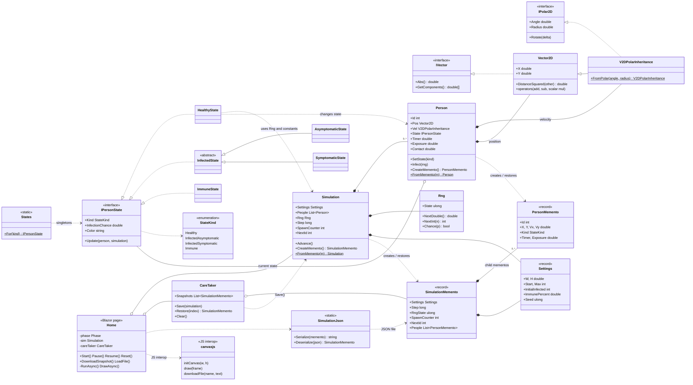

# Lab 3 – Class diagram

```mermaid
classDiagram
    direction LR

    %% ---------- Lab 2 vectors ----------
    class IVector {
        <<interface>>
        +Abs() double
        +GetComponents() double[]
    }
    class IPolar2D {
        <<interface>>
        +Angle double
        +Radius double
        +Rotate(delta)
    }
    class Vector2D {
        +X double
        +Y double
        +DistanceSquared(other) double
        +operators (add, sub, scalar mul)
    }
    class V2DPolarInheritance {
        +FromPolar(angle, radius)$ V2DPolarInheritance
    }
    IVector <|.. Vector2D
    Vector2D <|-- V2DPolarInheritance
    IPolar2D <|.. V2DPolarInheritance

    %% ---------- STATE pattern ----------
    class StateKind {
        <<enumeration>>
        Healthy
        InfectedAsymptomatic
        InfectedSymptomatic
        Immune
    }
    class IPersonState {
        <<interface>>
        +Kind StateKind
        +InfectionChance double
        +Color string
        +Update(person, simulation)
    }
    class HealthyState
    class InfectedState {
        <<abstract>>
    }
    class AsymptomaticState
    class SymptomaticState
    class ImmuneState
    class States {
        <<static>>
        +For(kind)$ IPersonState
    }
    IPersonState <|.. HealthyState
    IPersonState <|.. InfectedState
    IPersonState <|.. ImmuneState
    InfectedState <|-- AsymptomaticState
    InfectedState <|-- SymptomaticState
    States ..> IPersonState : singletons
    IPersonState ..> StateKind

    %% ---------- Simulated objects ----------
    class Person {
        +Id int
        +Pos Vector2D
        +Vel V2DPolarInheritance
        +State IPersonState
        +Timer double
        +Exposure double
        +Contact double
        +SetState(kind)
        +Infect(rng)
        +CreateMemento() PersonMemento
        +FromMemento(m)$ Person
    }
    class Simulation {
        +Settings Settings
        +People List~Person~
        +Rng Rng
        +Step long
        +SpawnCounter int
        +NextId int
        +Advance()
        +CreateMemento() SimulationMemento
        +FromMemento(m)$ Simulation
    }
    class Rng {
        +State ulong
        +NextDouble() double
        +NextInt(n) int
        +Chance(p) bool
    }
    Person o-- IPersonState : current state
    Person *-- V2DPolarInheritance : velocity
    Person *-- Vector2D : position
    Simulation "1" *-- "0..*" Person
    Simulation *-- Rng
    Simulation *-- Settings
    HealthyState ..> Simulation : uses Rng and constants
    HealthyState ..> Person : changes state

    %% ---------- MEMENTO pattern ----------
    class Settings {
        <<record>>
        +W, H double
        +Start, Max int
        +InitialInfected int
        +ImmunePercent double
        +Seed ulong
    }
    class PersonMemento {
        <<record>>
        +Id int
        +X, Y, Vx, Vy double
        +Kind StateKind
        +Timer, Exposure double
    }
    class SimulationMemento {
        <<record>>
        +Settings Settings
        +Step long
        +RngState ulong
        +SpawnCounter int
        +NextId int
        +People List~PersonMemento~
    }
    class CareTaker {
        +Snapshots List~SimulationMemento~
        +Save(simulation)
        +Restore(index) SimulationMemento
        +Clear()
    }
    class SimulationJson {
        <<static>>
        +Serialize(memento) string
        +Deserialize(json) SimulationMemento
    }
    SimulationMemento *-- "0..*" PersonMemento : child mementos
    SimulationMemento *-- Settings
    Simulation ..> SimulationMemento : creates / restores
    Person ..> PersonMemento : creates / restores
    CareTaker o-- SimulationMemento
    CareTaker ..> Simulation : Save()
    SimulationJson ..> SimulationMemento : JSON file

    %% ---------- UI ----------
    class Home {
        <<Blazor page>>
        -phase Phase
        -sim Simulation
        -careTaker CareTaker
        +Start() Pause() Resume() Reset()
        +DownloadSnapshot() LoadFile()
        -RunAsync() DrawAsync()
    }
    class canvasjs {
        <<JS interop>>
        initCanvas(w, h)
        draw(frame)
        downloadFile(name, text)
    }
    Home o-- Simulation
    Home o-- CareTaker
    Home ..> SimulationJson
    Home ..> canvasjs : JS interop
```
